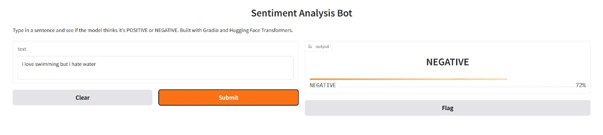

## Gradio Sentiment Analysis

A simple Sentiment Analysis web application built using Python, Gradio, and a pre-trained NLP model. This project allows users to input text and receive sentiment predictions (Positive, Negative, Neutral) instantly via an interactive web interface.

## Features

Real-time sentiment analysis of user input text.

Easy-to-use web interface powered by Gradio.

Lightweight and fast deployment.

Can be extended to integrate with other NLP models.

## Outputs:




## Installation and Setup

1. Clone the repository
```bash
git clone https://github.com/kondurupriyanka/ML_Gradio_Sentiment_Analysis.git
cd ML_Gradio_Sentiment_Analysis

### 2. Create a virtual environment (optional but recommended)
```bash
python -m venv venv
source venv/bin/activate      # Linux/Mac
venv\Scripts\activate         # Windows

### 3. Install required dependencies
```bash
pip install -r requirements.txt

### OR 
```bash
pip install gradio 
pip install pandas openpyxl
pip install py2pdf


### requirements.txt should include:
```bash
gradio
transformers
torch

### 4. Run the application
```bash
python app.py
python app2.py

### 5. Open the local Gradio interface

After running app.py, Gradio will provide a local URL (like http://127.0.0.1:7860) where you can test the sentiment analysis.

### Usage
```bash
Open the Gradio interface in your browser.

Enter any text in the input box.

Click the Submit button.

View the predicted sentiment (Positive, Negative, Neutral) instantly.

### Project Structure
```bash
Gradio-Sentiment-Analysis/
│
├── app.py                # Main Python script to run Gradio app
├── requirements.txt      # Python dependencies
├── README.md             # Project documentation
├── models/               # Folder for storing any pre-trained NLP models (optional)
└── assets/               # Images or other assets for the app
